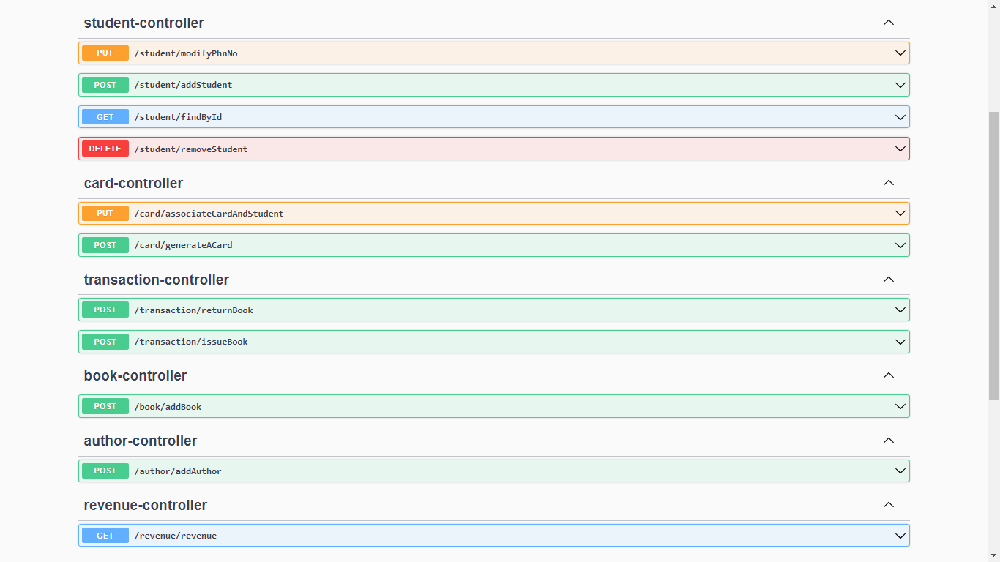
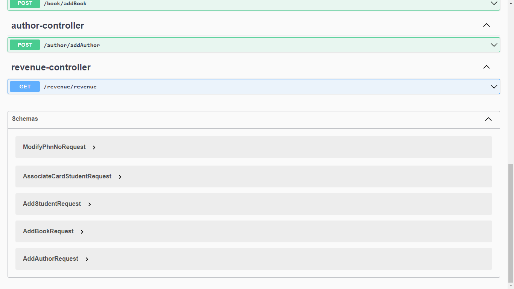
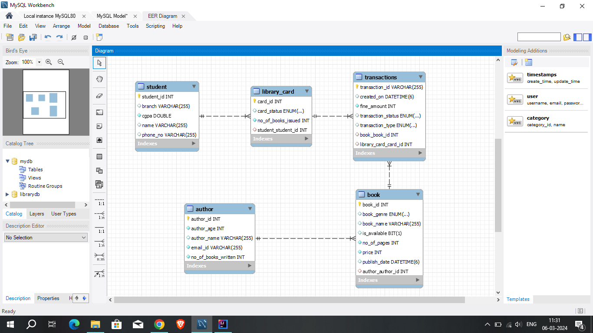

# Library Management System

In this project, I have created different APIs using Spring Boot. I used Swagger UI to display the APIs.

These are the schemas that I have used in this project.

This is the mapping that I have created, which includes many foreign keys for seamless navigation.
